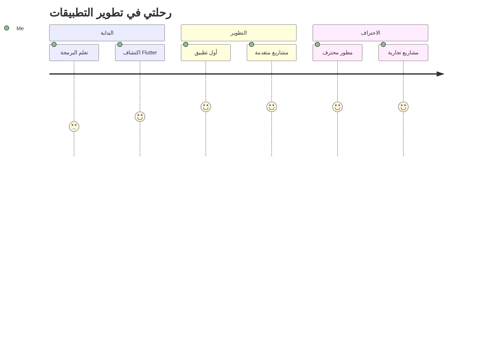

# 👋 مرحباً، أنا محمد فوزى
## 🚀 مطور تطبيقات الجوال | Flutter Developer

<div align="center">
  
</div>

---

## 🧑‍💻 نبذة عني

```dart
class MohamedFawzy {
  final String name = "محمد فوزى";
  final String role = "Flutter Developer";
  final List<String> expertise = [
    "📱 تطوير تطبيقات الجوال",
    "🎨 تصميم واجهات المستخدم",
    "⚡ تحسين الأداء",
    "🔗 ربط APIs",
    "🚀 النشر والتوزيع"
  ];
  
  String getMotivation() {
    return "أحول الأفكار إلى تطبيقات واقعية تخدم المستخدمين 🚀";
  }
}
```

---

## 🛠️ التقنيات والأدوات

<div align="center">

### 📱 Mobile Development


### 🎨 UI/UX & Design


### 🔧 Backend & Database


### ⚙️ Tools & Platform


</div>

---

## 📊 إحصائيات GitHub

<div align="center">
  
  
</div>

<div align="center">
  
</div>

---

## 🏆 مشاريعي المميزة

<div align="center">

| 🎯 المشروع | 📝 الوصف | 🛠️ التقنيات |
|------------|-----------|-------------|
| **🛒 تطبيق التسوق الإلكتروني** | تطبيق متكامل للتسوق الإلكتروني مع نظام دفع | Flutter, Firebase, Stripe |
| **📚 تطبيق إدارة المهام** | تطبيق لإدارة المهام اليومية مع تذكيرات | Flutter, SQLite, Local Notifications |
| **🎵 مشغل الموسيقى** | مشغل موسيقى بتصميم عصري وميزات متقدمة | Flutter, Audio Players, Custom UI |
| **🌤️ تطبيق الطقس** | تطبيق الطقس مع توقعات دقيقة وتصميم جذاب | Flutter, Weather API, Animations |

</div>

---

## 🎯 خدماتي

<div align="center">

```
🔥 ما أقدمه لك:

┌─────────────────────────────────────────┐
│  📱 تطوير تطبيقات Flutter من الصفر      │
│  🎨 تصميم واجهات مستخدم حديثة وجذابة    │
│  ⚡ تحسين أداء التطبيقات الموجودة       │
│  🔗 ربط التطبيقات بقواعد البيانات      │
│  🚀 نشر التطبيقات على المتاجر         │
│  🛠️ صيانة ودعم فني مستمر              │
└─────────────────────────────────────────┘
```

</div>

---

## 📈 رحلتي في البرمجة



---

## 🌟 لماذا أختار Flutter؟

<div align="center">

| ⚡ السرعة | 🎨 التصميم | 📱 متعدد المنصات | 🚀 الأداء |
|----------|------------|------------------|----------|
| تطوير سريع بكود واحد | واجهات جميلة ومرنة | Android & iOS معاً | أداء عالي ومستقر |

</div>

---

## 📫 تواصل معي

<div align="center">

[](mailto:your.email@example.com)
[](https://linkedin.com/in/yourprofile)
[](https://wa.me/yourphonenumber)
[](https://t.me/yourusername)

</div>

---

<div align="center">

## 💭 اقتباسي المفضل

*"الكود النظيف ليس فقط يعمل، بل يحكي قصة جميلة"*

---

### 🎉 شكراً لزيارة ملفي الشخصي!

 **دعنا ننشئ شيئاً رائعاً معاً!** 

</div>

---

<div align="center">
  
</div>
