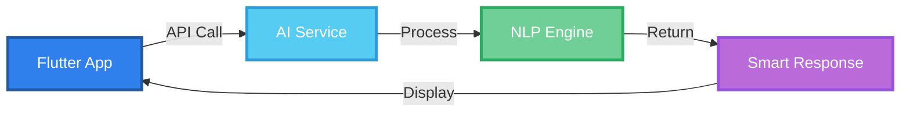
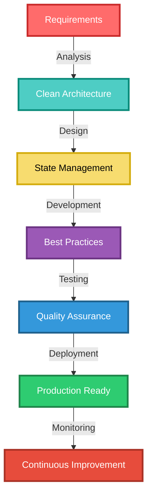

<div align="center">


<p align="center">
  
  
  
</p>

</div>

<br>

##  About Me

```dart
class Developer {
  final String name = "Mohamed Fawzy";
  final String role = "Senior Flutter Developer";
  final List<String> expertise = [
    "🏗 Clean Architecture (SOLID, Repository Pattern)",
    "🔄 Advanced State Management (BLoC / Cubit / MVVM)",
    "🔥 Firebase & Supabase Integration",
    "🔗 REST API Integration (Dio / HTTP)",
    "🤖 AI-Powered Features",
    "🎨 Pixel-Perfect UI/UX",
    "⚡ Performance Optimization"
  ];
  
  String philosophy() => "Clean code is a responsibility, not a preference.";
  
  void buildApps() {
    print("Building the future, one widget at a time 🚀");
    print("I don't just build apps — I build structured systems.");
  }
}
```

<div align="center">

### 🎯 Core Principles

<table>
<tr>
<td width="33%" align="center">

<br><strong>Clean Architecture</strong>
<br>SOLID • Repository Pattern
<br>Dependency Injection
</td>
<td width="33%" align="center">

<br><strong>State Management</strong>
<br>BLoC • Cubit • Provider
<br>MVVM Pattern
</td>
<td width="33%" align="center">

<br><strong>Performance</strong>
<br>Optimization • Scalability
<br>Production-Ready
</td>
</tr>
</table>

</div>

<br>

##  AI Integration Expertise

<div align="center">


</div>

<br>

<div align="center">

| 🎯 Feature | 🚀 Status | 💡 Use Case |
|-----------|----------|------------|
| 📝 **Text Summarization** | ✅ Production | Long-form content processing |
| 😊 **Sentiment Analysis** | ✅ Production | User feedback analysis |
| 🌍 **Language Detection** | ✅ Production | Multi-language apps |
| 🔑 **Keyword Extraction** | ✅ Production | Content categorization |
| 💬 **AI Chat Systems** | ✅ Production | Intelligent chatbots |
| 🎤 **Speech-to-Text** | ✅ Production | Voice commands |
| 📊 **Smart Data Processing** | ✅ Production | Predictive analytics |

</div>

<br>

<div align="center">


```mermaid
graph LR
    A[Flutter App] -->|API Call| B[AI Service]
    B -->|Process| C[NLP Engine]
    C -->|Return| D[Smart Response]
    D -->|Display| A
    
    style A fill:#2F80ED,stroke:#1E5AA8,stroke-width:3px,color:#fff
    style B fill:#56CCF2,stroke:#2D9CDB,stroke-width:3px,color:#fff
    style C fill:#6FCF97,stroke:#27AE60,stroke-width:3px,color:#fff
    style D fill:#BB6BD9,stroke:#9B51E0,stroke-width:3px,color:#fff
```

**🎯 End-to-end intelligent user experiences** → Seamlessly connecting Flutter apps with AI APIs

</div>

<br>

##  Tech Stack

<div align="center">

### 📱 Mobile Development

<p>


</p>

### 🔥 Backend & Database

<p>


</p>

### 🔗 API & Networking

<p>


</p>

### 🎨 UI/UX & Design

<p>


</p>

### ⚙️ Tools & Platforms

<p>


</p>

### 🤖 AI & ML Integration

<p>


</p>

</div>

<br>

##  What I Build

<div align="center">

<table>
<tr>
<td width="50%" valign="top">

### 🛒 E-commerce Applications
```yaml
Features:
  - Payment Integration (Stripe, PayPal)
  - Multi-language Support (i18n)
  - Admin Dashboard
  - Real-time Inventory
  - Push Notifications
  - Analytics Integration
```

</td>
<td width="50%" valign="top">

### 💬 Real-time Chat Apps
```yaml
Features:
  - Firestore Integration
  - Push Notifications (FCM)
  - Media Sharing (Images/Videos)
  - Group Chats
  - Online/Offline Status
  - Message Encryption
```

</td>
</tr>
<tr>
<td width="50%" valign="top">

### 🤖 AI-Powered Applications
```yaml
Features:
  - NLP Integration
  - Machine Learning Models
  - Smart Recommendations
  - Predictive Analytics
  - Voice Commands
  - Image Recognition
```

</td>
<td width="50%" valign="top">

### 🧑‍💼 Multi-role Systems
```yaml
Features:
  - User/Admin/Moderator Roles
  - Permission Management
  - Dynamic Dashboards
  - Advanced Analytics
  - Audit Logs
  - Secure Authentication
```

</td>
</tr>
</table>

<br>


</div>

<br>

##  Core Strengths

<div align="center">

<table>
<tr>
<td align="center" width="33%">

<br><br>
<strong>Clean & Maintainable Code</strong>
<br><br>
<sub>SOLID Principles • Design Patterns • Best Practices</sub>
</td>
<td align="center" width="33%">

<br><br>
<strong>Scalable Architecture</strong>
<br><br>
<sub>Clean Architecture • Repository Pattern • DI</sub>
</td>
<td align="center" width="33%">

<br><br>
<strong>Advanced State Management</strong>
<br><br>
<sub>BLoC • Cubit • Provider • GetX</sub>
</td>
</tr>
<tr>
<td align="center" width="33%">

<br><br>
<strong>Secure API Integration</strong>
<br><br>
<sub>REST • GraphQL • Token Management</sub>
</td>
<td align="center" width="33%">

<br><br>
<strong>Real Backend Experience</strong>
<br><br>
<sub>Firebase • Supabase • Cloud Functions</sub>
</td>
<td align="center" width="33%">

<br><br>
<strong>Performance Focused</strong>
<br><br>
<sub>Optimization • Lazy Loading • Caching</sub>
</td>
</tr>
</table>

<br>

### 🏆 Development Philosophy

<table>
<tr>
<td align="center">


```mermaid
flowchart TD
    A[Requirements] -->|Analysis| B[Clean Architecture]
    B -->|Design| C[State Management]
    C -->|Development| D[Best Practices]
    D -->|Testing| E[Quality Assurance]
    E -->|Deployment| F[Production Ready]
    F -->|Monitoring| G[Continuous Improvement]
    
    style A fill:#FF6B6B,stroke:#C92A2A,stroke-width:3px,color:#fff
    style B fill:#4ECDC4,stroke:#0A8B7A,stroke-width:3px,color:#fff
    style C fill:#F7DC6F,stroke:#D4AC0D,stroke-width:3px,color:#000
    style D fill:#9B59B6,stroke:#6C3483,stroke-width:3px,color:#fff
    style E fill:#3498DB,stroke:#1F618D,stroke-width:3px,color:#fff
    style F fill:#2ECC71,stroke:#1E8449,stroke-width:3px,color:#fff
    style G fill:#E74C3C,stroke:#A93226,stroke-width:3px,color:#fff
```

</td>
</tr>
</table>

</div>

<br>

##  Let's Connect

<div align="center">

<<a href="mailto:mofawzy.com7@gmail.com">

</a>

<a href="https://www.linkedin.com/in/mohamed-fawzy-02388729b">

</a>

<a href="https://wa.me/201068808559">

</a>

<a href="https://t.me/M07amedFawzy">

</a>
<br><br>


</div>

<br>

---

<div align="center">

### 💭 Philosophy


<br><br>

### ⚡ Quick Stats

<p>


</p>

<br>

### 🔥 Contribution Streak


<br><br>

### 🏆 GitHub Trophies


<br><br>

### 📊 Activity Graph


<br><br>


</div>
