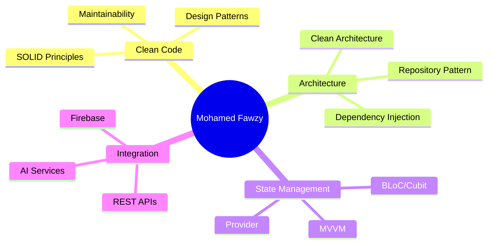

<div align="center">

# 👋 Hello, I'm Mohamed Fawzy


<p align="center">
  
</p>

</div>

---

## 🧠 About Me

I'm a **Flutter Developer** passionate about crafting **scalable, production-ready mobile applications** using clean architecture and modern development practices.

```dart
class Developer {
  final String name = "Mohamed Fawzy";
  final String role = "Flutter Developer";
  final List<String> focus = [
    "Clean Architecture",
    "AI Integration",
    "Performance Optimization"
  ];
  
  void buildApps() => print("Building the future, one widget at a time 🚀");
}
```

### Core Principles
- 🏗 **Clean Architecture** (SOLID, Repository Pattern)
- 🔄 **State Management** (BLoC / Cubit / MVVM)
- 🔥 **Firebase & Supabase** Integration
- 🔗 **REST API** Integration (Dio / HTTP)
- 🤖 **AI Feature** Integration
- 🎨 **Pixel-Perfect** UI/UX
- ⚡ **Performance** First

> I don't just build apps — I build structured systems.

---

## 🤖 AI Integration Expertise

<div align="center">

| Feature | Implementation |
|---------|----------------|
| 📝 Text Summarization | ✅ Production Ready |
| 😊 Sentiment Analysis | ✅ Production Ready |
| 🌍 Language Detection | ✅ Production Ready |
| 🔑 Keyword Extraction | ✅ Production Ready |
| 💬 AI Chat Systems | ✅ Production Ready |
| 🎤 Speech-to-Text | ✅ Production Ready |
| 📊 Smart Data Processing | ✅ Production Ready |

</div>

**End-to-end intelligent user experiences** → Connecting Flutter apps with AI APIs seamlessly.

---

## 🛠 Tech Stack

<div align="center">

### 📱 Mobile Development


### 🔥 Backend & Database


### 🔗 API & Networking


### 🎨 UI/UX


### ⚙️ Tools & Platforms


</div>

---

## 🚀 What I Build

<div align="center">

| Project Type | Features |
|-------------|----------|
| 🛒 **E-commerce Apps** | Payments • Multi-language • Admin Systems |
| 💬 **Real-time Chat** | Firestore • Push Notifications • Media Sharing |
| 🤖 **AI-powered Apps** | NLP • ML Integration • Smart Features |
| 🧑‍💼 **Multi-role Systems** | User • Admin • Dashboard |
| 📦 **Enterprise Solutions** | Scalable • Secure • Production-ready |

</div>

---

## 📊 Core Strengths

<div align="center">


```mermaid
mindmap
  root((Mohamed Fawzy))
    Clean Code
      SOLID Principles
      Design Patterns
      Maintainability
    Architecture
      Clean Architecture
      Repository Pattern
      Dependency Injection
    State Management
      BLoC/Cubit
      Provider
      MVVM
    Integration
      REST APIs
      Firebase
      AI Services
```

</div>

<table align="center">
  <tr>
    <td align="center">✨ Clean & Maintainable Code</td>
    <td align="center">🏗 Scalable Architecture</td>
  </tr>
  <tr>
    <td align="center">🔄 Advanced State Management</td>
    <td align="center">🔐 Secure API Integration</td>
  </tr>
  <tr>
    <td align="center">🎯 Real Backend Experience</td>
    <td align="center">⚡ Performance Focused</td>
  </tr>
</table>

---

## 📫 Let's Connect

<div align="center">

[](YOUR_LINKEDIN_URL)
[](YOUR_GITHUB_URL)
[](mailto:YOUR_EMAIL)
[](YOUR_TWITTER_URL)

</div>

---

<div align="center">

### 💭 Philosophy

> **"Clean code is a responsibility, not a preference."**


</div>
