# 👋 Hello, I'm Mohamed Fawzy
## 🚀 Mobile App Developer | Flutter Expert

<div align="center">
  
</div>

<div align="center">
  
</div>

---

## 🧑‍💻 About Me

```dart
class MohamedFawzy {
  final String name = "Mohamed Fawzy";
  final String role = "Flutter Developer";
  final String location = "Egypt 🇪🇬";
  final List<String> expertise = [
    "📱 Mobile App Development",
    "🎨 UI/UX Design",
    "⚡ Performance Optimization",
    "🔗 API Integration",
    "🚀 App Store Deployment",
    "🧪 Testing & Quality Assurance"
  ];
  
  String getMotivation() {
    return "Transforming ideas into beautiful, functional mobile experiences 🚀";
  }
  
  bool isAvailableForWork() => true;
}
```


---

## 🛠️ Tech Stack & Tools

<div align="center">

### 📱 Mobile Development


### 🎨 Design & Frontend


### 🔧 Backend & Database


### ⚙️ Tools & Platform


</div>

<div align="center">


</div>

---

## 🎯 My Services

<div align="center">

### 💼 What I Offer

<table>
<tr>
<td align="center" width="33%">

**📱 Mobile App Development**
<br><br>

<br><br>
Cross-platform apps with Flutter
<br>
Native performance & beautiful UI

</td>
<td align="center" width="33%">

**🎨 UI/UX Design**
<br><br>

<br><br>
Modern, intuitive designs
<br>
User-centered approach

</td>
<td align="center" width="33%">

**⚡ App Optimization**
<br><br>

<br><br>
Performance tuning
<br>
Code quality improvements

</td>
</tr>
</table>

</div>

<div align="center">

```
🔥 Complete Mobile Development Solution

┌─────────────────────────────────────────┐
│  📋 Requirements Analysis               │
│  🎨 UI/UX Design & Prototyping         │
│  📱 Cross-Platform Development         │
│  🔗 Backend Integration & APIs         │
│  🧪 Testing & Quality Assurance        │
│  🚀 App Store Deployment               │
│  🛠️ Maintenance & Support              │
└─────────────────────────────────────────┘
```

</div>

---

## 🌟 Why Choose Flutter?

<div align="center">

<table>
<tr>
<td align="center">

<br><strong>Fast Development</strong>
<br>Single codebase for multiple platforms
</td>
<td align="center">

<br><strong>Beautiful UI</strong>
<br>Flexible and customizable widgets
</td>
<td align="center">

<br><strong>Cross-Platform</strong>
<br>iOS & Android with one code
</td>
<td align="center">

<br><strong>High Performance</strong>
<br>Native-like performance
</td>
</tr>
</table>

</div>

---

## 🚀 Development Process

```mermaid
flowchart LR
    A[📋 Requirements] --> B[🎨 Design]
    B --> C[👨‍💻 Development]
    C --> D[🧪 Testing]
    D --> E[🚀 Deployment]
    E --> F[🛠️ Maintenance]
    
    style A fill:#1a1a2e,stroke:#16213e,stroke-width:2px,color:#00d2ff
    style B fill:#16213e,stroke:#1a1a2e,stroke-width:2px,color:#00d2ff
    style C fill:#0f3460,stroke:#16213e,stroke-width:2px,color:#00d2ff
    style D fill:#1a1a2e,stroke:#0f3460,stroke-width:2px,color:#00d2ff
    style E fill:#16213e,stroke:#1a1a2e,stroke-width:2px,color:#00d2ff
    style F fill:#0f3460,stroke:#16213e,stroke-width:2px,color:#00d2ff
```



---


## 📊 Core Skills

<div align="center">

<table>
<tr>
<td align="center" width="25%">

<br><strong>Flutter</strong>
</td>
<td align="center" width="25%">

<br><strong>Dart</strong>
</td>
<td align="center" width="25%">

<br><strong>Firebase</strong>
</td>
<td align="center" width="25%">

<br><strong>UI/UX Design</strong>
</td>
</tr>
<tr>
<td align="center" width="25%">

<br><strong>API Integration</strong>
</td>
<td align="center" width="25%">

<br><strong>State Management</strong>
</td>
<td align="center" width="25%">

<br><strong>Testing</strong>
</td>
<td align="center" width="25%">

<br><strong>App Deployment</strong>
</td>
</tr>
</table>

</div>

---

## 📫 Let's Connect

<div align="center">

[](mailto:mofawzy.com7@gmail.com)
[](www.linkedin.com/in/mohamed-fawzy-02388729b)
[](https://wa.me/201068808559)
[](https://t.me/mofawzy2004)

</div>

---

<div align="center">

## 💭 My Philosophy

### *"Clean code is not written by following a set of rules. Clean code is written by someone who cares about the craft."*


---

### 🎉 Thanks for visiting my profile!

 **Let's build something amazing together!** 


</div>

---

<div align="center">
  
  
</div>
